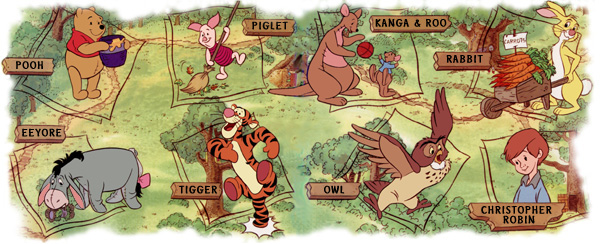
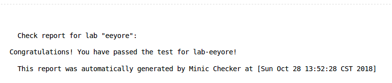

# MiniC-Compiler

[](https://travis-ci.org/LC-John/MiniC-Compiler)

This repo is a series of labs from the Compiler Lab course, EECS, PKU, which aims for a compiler to compile miniC (a subset of C language) source code to RISC-V (majorly RV64I) executable.

Repo site: https://github.com/LC-John/MiniC-Compiler



The three-phase work flow is shown below.

```
MiniC => Eeyore => Tigger => RISC-V
```

You can find the BNF rules and instructions [here](./appendices/README.md).

## Requirement

```
gcc/g++		version == 7.3.0
Flex/Lex	version == 2.6.0
Bison/Yacc(GNU)	version == 3.0.4
```

## Phase 1. MiniC2Eeyore & Type Checking

It is in the directory "src/MiniC2Eeyore". Use the command "make" to compile the project, and get the executable compiler "eeyore". The options of "eeyore" is shown as below.

```
-I/--input/--infile <filename>		set the input file, whose default is STDIN
-O/--output/--outfile <filename>	set the output file, whose default is STDOUT
-C/--cheating/--cheatingfile <filename>	set the cheating output file, whose default is STDERR
-S/--symtab				output the symbol table to STDOUT
-T/--tree				output the parse tree to STDOUT
```

The work flow of this specific phase is shown below.

```
MiniC => Parse Tree & Symbol Table => Type checking => Eeyore
```

The parse tree is built using Flex & Bison. A symbol table (including all variables and functions) is extracted while building the parse tree.

An example shown below, is generated from "example.c" by running the command "./eeyore -I example.c -T -S".

The original MiniC file "example.c" is shown below.

```C
// example.c
1  int a;
2  int b;
3  
4  int main(){
5  	a = 10;
6  	b = 20;
7  	int c;
8  	c = a + b;
9  	return c;
10  }
```

The symbol table looks like below. [CLICK HERE](/images/parse_tree_example.md) to see the parse tree generated from "example.c".

```
// symbol table of example.c
0	[INT] 	a           	L1~L-1	T0
1	[INT] 	b           	L2~L-1	T1
2	[INT] 	c           	L7~L10	T2
3	[FUNC]	main        	L4~L-1
```

Error/warning checking is performed based on the parse tree and the symbol table. The following errors/warnings will be checked. [CLICK HERE](/images/ew.md) to see the examples of errors and warnings.

```
ERROR
  Conflict variables  -- Variables have the same name in the same scope
  Conflict function(s)  -- Functions or functions and variable have the same name even in different scope
  Wrong assignment  -- Assigning to invalid integer variable, or even not-a-variable
  Wrong parameter(s)  -- Assigning invalid actual parameters to the function call
  Wrong expression  -- Using arithmetic expression in condition
  Undefined variable  -- Using an undefined variable
  Undefined function  -- Using an undefined function (the function may be declared)

WARNING 
  Mixed expression  -- Mix the logical and arithmatic expressions together
  No return   -- The last statement in the function body is not a return
  Function declarition in function body -- Declare a function inside another function body, which is allowed, but highly unrecommended!
```

Transformation is performed on the MiniC parse tree. A depth-first traverse is performed, and the Eeyore code for the sub-parse-tree of each corresponding node is generated in the meantime. The Eeyore code generated from "example.c" is shown as below.

```
// Eeyore code
//     MiniC source: example.c
//     Author: Zhang Huangzhao
//
// View https://github.com/LC-John/MiniC-Compiler for detail


var T0	// [VAR] a @ Line 1
var T1	// [VAR] b @ Line 2

f_main [0]	// [FUNC] main @ Line 10
	var t0
	t0 = 10	// [EXPR] NUM @ Line 5
	T0 = t0	// [STMT] VAR ASSN @ Line 5
	var t1
	t1 = 20	// [EXPR] NUM @ Line 6
	T1 = t1	// [STMT] VAR ASSN @ Line 6
	var T2	// [VAR] c @ Line 7
	var t2
	t2 = T0	// [EXPR] VAR @ Line 8
	var t3
	t3 = T1	// [EXPR] VAR @ Line 8
	var t4
	t4 = t2 + t3	// [EXPR] BI OP + @ Line 8
	T2 = t4	// [STMT] VAR ASSN @ Line 8
	var t5
	t5 = T2	// [EXPR] VAR @ Line 9
	return t5	// [STMT] RET @ Line 9
end f_main

```

It has passed the MiniC Checker automatic testing.



PHASE 1 (MiniC2Eeyore & type checking) COMPLETE!

## Phase 2. Eeyore2Tigger

It is in the directory "src/Eeyore2Tigger". Use the command "make" to compile the project, and get the executable compiler "tiggerC".

The work flow of this specific phase is shown below.

```
Eeyore => Mid => Liveness Analysis => Conflict Graph => Coloring & Register Allocation => Tigger
```

**Mid** is a medium representation between Eeyore and Tigger. It is very similiar to Tigger, while it uses the variables in Eeyore (eg. "T0", "t1", etc), instead of registers in Tigger (eg. "a0", "s1", "t2", etc), and the function stacks are not allocated as well. The translation from Eeyore to Mid is the same as MiniC2Eeyore.

Although, register allocation is not performed within Mid, as we stated before, there are still some registers applied in Mid. For example, ```a0-a7``` is always used as function parameters, and ```a0``` is always used as function return value. Such static allocation can be performed in Eeyore2Mid translation.

The arithmatic and logical and assignment operations, etc, are translated directly into Mid (Tigger-like style). However, there is a trick for variables:

1. Global variables/arrays. The load/store operation in Tigger for global variables are not symmetric. So we use sets of operations to make it symmetric.

```
GlobalVar = SrcVal
{
	loadaddr GlobalVar TempVar
	TempVar[0] = SrcVal
}
TgtVar = GlobalVar
{
	loadaddr GlobalVar TempVar
	TgtVar = TempVar[0]
}
GlobalVar[Idx] = SrcVal
{
	loadaddr GlobalVar TempVar
	TempVar = TempVar + Idx
	TempVar[0] = SrcVal
}
TgtVar = GlobalVar[Idx]
{
	loadaddr GlobalVar TempVar
	TempVar = TempVar + Idx
	TgtVar = TempVar[0]
}
```

2. Temparory variables/arrays. The temparory variables are applied within the function stack itself, and the registers and stacks are not allocated yet in Mid, thus the operations upon the temparory variables remains the same as Eeyore. Yet the temparory arrays are operated in similar way of global arrays.

The Mid code generated from "example.c" is shown as below. (The comments are added manually.) Notice there are two ```return``` in the end of ```f_main```. The last one is added manually, to make sure the function will return. Although ungly, it is effective. Maybe later, we will come up with a better solution.

```
v0 = 0		// Global variables
v1 = 0
f_main [ 0 ] 	// main function, with 0 parameter
t0 = 10		// a = 10
loadaddr v0 e0
e0[0] = t0
t1 = 20		// b = 20
loadaddr v1 e1
e1[0] = t1
loadaddr v0 e2	// get value of global variable "v0"
e3 = e2[0]
t2 = e3
loadaddr v1 e4	// get value of global variable "v1"
e5 = e4[0]
t3 = e5
t4 = t2 + t3	// c = a + b
T2 = t4
t5 = T2		// return value
__a0 = t5
return
return
end f_main
```

**Liveness analysis** is performed statement-wise. More specificly, each basic block contains one and only one statement of Mid. A backward analysis is performed upon this flow graph. For each statement, there is a USE set, and a DEF set, and for each block, there is a IN set and a OUT set. The rules are shown below, and the algorithm halt until it reaches the fixed point. (i.e. After one iteration, all IN's and OUT's remain the same.) As a result, the elements in the IN set of each basic block are live variables for this specific basic block.

```
OUT[BB] <= Union(IN[BB->nxt[i]])  // OUT set of BB is the union of all IN sets of BB's nxt basic block
IN[BB] <= Union(OUT[BB]/DEF[BB->Stmt], USE[BB->stmt])	// IN set of BB is the union of OUT set of BB without elements from DEF set of statement in BB, and USE set of statement in BB.
```

The liveness analysis result generated from "example.c" is shown as below.

```
1	v0 = 0		
2	v1 = 0		
3	f_main [ 0 ] 	
4	t0 = 10		// { }
5	loadaddr v0 e0	// { t0 }
6	e0[0] = t0	// { t0, e0 }
7	t1 = 20		// { }
8	loadaddr v1 e1	// { t1 }
9	e1[0] = t1	// { t1, e1 }
10	loadaddr v0 e2	// { }
11	e3 = e2[0]	// { e2 }
12	t2 = e3		// { e3 }
13	loadaddr v1 e4	// { t2 }
14	e5 = e4[0]	// { t2, e4 }
15	t3 = e5		// { t2, e5 }
16	t4 = t2 + t3	// { t2, t3 }
17	T2 = t4		// { t4 }
18	t5 = T2		// { T2 }
19	__a0 = t5	// { t5 }
20	return		// { __a0 }
21	return		
22	end f_main
```

**Conflict graph** is built based on the result of liveness analysis. For each basic block, any pair of variables in its live variable set are conflict, and there is an edge linking them in the conflict graph, indicating that these two variables cannot have the same color.

**Coloring & register allocation** is performed following the classic graph coloring algorithm. The allocation result genreated from "example.c" is shown [below](#tigger_example).

The final work is to generate the **Tigger** code. As a matter of fact, the translation from Mid to Tigger is mainly done after register allocation. The major work is just replace the variables in Mid with the corresponding registers. Function stack allocation and loading/storing caller/callee-saved registers are also doen in this step.

The Tigger code generated from "example.c" is shown as below. The comments are added manually.

<div id="tigger_example"></div>

```
v0 = 0		// Global variables
v1 = 0
f_main [0] [2]	// main function with 0 parameter and stack size of 2
store s0 0	// save the callee-saved registers
store s1 1
s1 = 10		// REG(t0) = s1
loadaddr v0 s0	// REG(e0) = s0
s0[0] = s1
s1 = 20		// REG(t1) = s1
loadaddr v1 s0	// REG(e1) = s0
s0[0] = s1
loadaddr v0 s0	// REG(e2) = s0
s1 = s0[0]	// REG(t2) = s1, e3 is coalesced
loadaddr v1 s0	// REG(e4) = s0
s0 = s0[0]	// REG(e5) = s0
a0 = s1 + s0	// REG(t5) = a0, many variables are coalesced
load 0 s0	// restore the callee-saved registers
load 1 s1
return		// return
load 0 s0
load 1 s1
return
end f_main
```

It has passed the MiniC Checker automatic testing.


PHASE 2 (Eeyore2Tigger) COMPLETE!

## Phase 3. Tigger2RISC-V

It is in the directory "src/Eeyore2Tigger". Use the command "make" to compile the project, and get the executable compiler "tiggerC".

The work flow of this specific phase is shown below.

```
Tigger => Parsed statements => RISC-V instructions => RISC-V assembly => RISC-V objective/executable
```

Parsing schedule of Tigger is the same as MiniC/Eeyore/Mid. However, since parse tree for Tigger is extremely simple, (which at most has only 3 layers,) there is no need to organize it as a tree. Instead, it is organized as a list of statements.

The statements of Tigger and their corresponding RISC-V instructions are shown in the table [below](#tigger_stmt2riscv_inst). Each statement of Tigger can be translated into a series of RISC-V instructions. The translation process is almost independent, (meaning the RISC-V instructions generated are related and only related to the specific Tigger statement,) it can be carried out sequentially. The only dependency of the translation processes is the stack size, which is defined in the function definination statement, and used in the return statement. This can be resolved by using a global stack size variable, for there cannot be two living stack size at the same time.

<div id="tigger_stmt2riscv_inst"></div>

| Tigger Statement                      | RISC-V Instructions     |
| ------------------------------------- | ----------------------- |
| VAR = VAL                             | .global VAR             |
|                                       | .section .sdata         |
|                                       | .align 2                |
|                                       | .type VAR, @object      |
|                                       | .size VAR, 4            |
|                                       | VAR:                    |
|                                       | .word VAL               |
| ARR = malloc SIZE                     | .comm ARR, SIZE*4, 4    |
| FUNC\[INT1\]\[INT2\]                  | .text                   |
| (SIZE=INT2/4+1)*16                    | .align 2                |
|                                       | .type FUNC, @function   |
|                                       | FUNC:                   |
|                                       | add sp, sp, SIZE        |
|                                       | sw ra, SIZE(sp)         |
| end FUNC                              | .size FUNC, .-FUNC      |
| REG = REG1 + REG2                     | add REG, REG1, REG2     |
| REG = REG1 - REG2                     | sub REG, REG1, REG2     |
| REG = REG1 * REG2                     | mul REG, REG1, REG2     |
| REG = REG1 / REG2                     | div REG, REG1, REG2     |
| REG = REG1 % REG2                     | rem REG, REG1, REG2     |
| REG = REG1 && REG2                    | seqz REG, REG1          |
|                                       | addi REG REG, -1        |
|                                       | and REG, REG, REG2      |
|                                       | snez REG, REG           |
| REG = REG1 \|\| REG2                  | or REG, REG1, REG2      |
|                                       | snez REG, REG           |
| REG = REG1 == REG2                    | xor REG, REG1, REG2     |
|                                       | seqz REG, REG           |
| REG = REG1 != REG2                    | xor REG, REG1, REG2     |
|                                       | snez REG, REG           |
| REG = REG1 < REG2                     | slt REG, REG1, REG2     |
| REG = REG1 > REG2                     | slt REG, REG2, REG1     |
| REG = REG1 + IMM                      | addi REG, REG1, IMM     |
| REG = REG1 - IMM                      | addi REG, REG1, -IMM    |
| REG = REG1 * IMM                      | addi REG, x0, IMM       |
|                                       | mul REG, REG1, REG      |
| REG = REG1 / IMM                      | addi REG, x0, IMM       |
|                                       | div REG, REG1, REG      |
| REG = REG1 % IMM                      | addi REG, x0, IMM       |
|                                       | rem REG, REG1, REG      |
| REG = REG1 && IMM                     | seqz REG, REG1          |
|                                       | addi REG, REG, -1       |
|                                       | andi REG, REG, IMM      |
|                                       | snez REG, REG           |
| REG = REG1 \|\| REG2                  | ori REG, REG1, IMM      |
|                                       | snez REG, REG           |
| REG = REG1 == IMM                     | addi REG, x0, IMM       |
|                                       | xor REG, REG1, REG      |
|                                       | seqz REG, REG           |
| REG = REG1 != IMM                     | addi REG, x0, IMM       |
|                                       | xor REG, REG1, REG      |
|                                       | snez REG, REG           |
| REG = REG1 < IMM                      | slti REG, REG1, IMM     |
| REG = REG1 > IMM                      | addi REG, x0, IMM       |
|                                       | slt REG, REG, REG1      |
| REG = + REG1                          | add REG, REG1, x0       |
| REG = - REG1                          | sub REG, x0, REG1       |
| REG = ! REG1                          | xori REG, REG1, -1      |
|                                       | snez REG, REG           |
| REG = REG1                            | add REG, x0, REG1       |
| REG = IMM                             | addi REG, x0, IMM       |
| REG[IMM] = REG1                       | sw REG1, IMM(REG)       |
| REG = REG1[IMM]                       | lw REG, IMM(REG1)       |
| if REG1 < REG2 goto LABEL             | blt REG1, REG2, .LABEL  |
| if REG1 > REG2 goto LABEL             | blt REG2, REG1, .LABEL  |
| if REG1 <= REG2 goto LABEL            | ble REG1, REG2, .LABEL  |
| if REG1 >= REG2 goto LABEL            | ble REG2, REG1, .LABEL  |
| if REG1 == REG2 goto LABEL            | beq REG1, REG2, .LABEL  |
| if REG1 != REG2 goto LABEL            | bne REG1, REG2, .LABEL  |
| goto LABEL                            | j .LABEL                |
| LABEL:                                | .LABEL:                 |
| call FUNC                             | call FUNC               |
| store REG IMM                         | sw REG, IMM(sp)         |
| load IMM REG                          | lw REG, IMM(sp)         |
| load VAR REG                          | lui REG, %hi(VAR)       |
|                                       | lw REG, %lo(VAR)(REG)   |
| loadaddr IMM REG                      | add REG, sp, IMM        |
| loadaddr VAR REG                      | lui REG, %hi(VAR)       |
|                                       | addi REG, %lo(VAR)(REG) |
| return                                | lw ra, SIZE-4(sp)       |
| (SIZE is from “FUNC\[INT1\]\[INT2\]”) | addi sp, sp, SIZE       |
|                                       | jr ra                   |

The RISC-V (64bit) code generated from "example.c" is shown as below.

```
	.global v0
	.section .sdata
	.align 2
	.type v0, @object
	.size v0, 4
v0:
	.word 0
	.global v1
	.section .sdata
	.align 2
	.type v1, @object
	.size v1, 4
v1:
	.word 0
	.text	
	.align 2
	.global main
	.type main, @function
main:
	add sp, sp, -16
	sw ra, 12(sp)
		addi a1, x0, 10
		lui a0, %hi(v0)
		addi a0, a0, %lo(v0)
		sw a1, 0(a0)
		addi a1, x0, 20
		lui a0, %hi(v1)
		addi a0, a0, %lo(v1)
		sw a1, 0(a0)
		lui a0, %hi(v0)
		addi a0, a0, %lo(v0)
		lw a1, 0(a0)
		lui a0, %hi(v1)
		addi a0, a0, %lo(v1)
		lw a0, 0(a0)
		add a0, a1, a0
		lw ra, 12(sp)
		addi sp, sp, 16
		jr ra
		lw ra, 12(sp)
		addi sp, sp, 16
		jr ra
	.size main, .-main
	.global v2
	.section .sdata
	.align 2
	.type v2, @object
	.size v2, 4
v2:
	.word 0
```

It has passed the MiniC Checker automatic testing.


PHASE 3 (Tigger2RISCV) COMPLETE!
